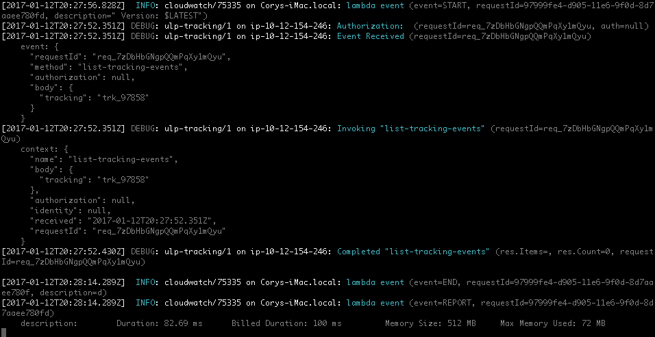

# pretty-bunyan-cloudwatch-logs

A command-line utility that allows you to monitor a lambda function's cloudwatch log stream.

This is [cwtail](https://github.com/kennu/cwtail) with a couple slight modifications to pipe things through bunyan (specifically bunyan-prettystream).

## Installing

`npm install stampr/pretty-bunyan-cloudwatch-logs --save-dev`

## Using

Some of cwtail's options were removed (e.g. eol), but most are still valid.  

To just make-it-go, you probably want:

`AWS_REGION=us-east-1 pbcw -p [profile] -f /aws/lambda/[function]`

- `[profile]`: Name of your AWS cli profile in `~/.aws/credentials`
- `[function]`: Name of the lambda function as it exists in the log group
- `AWS_REGION` is optional.  If not specified, the region will be pulled from your aws credentials file.
